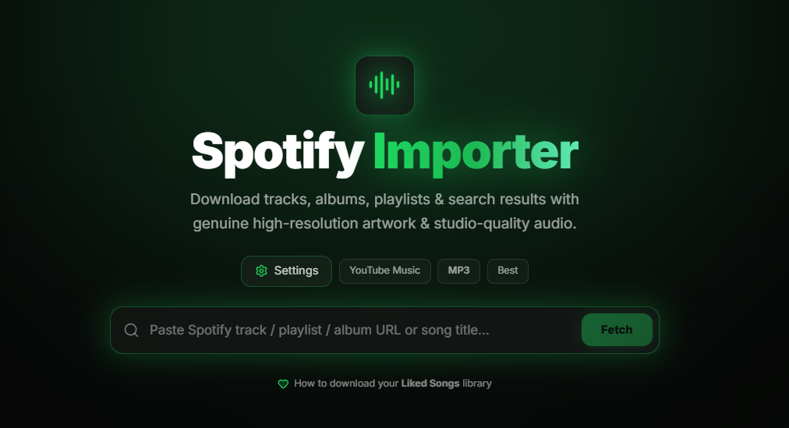
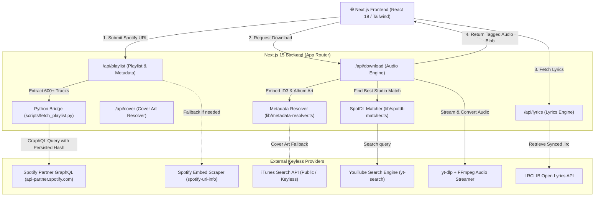
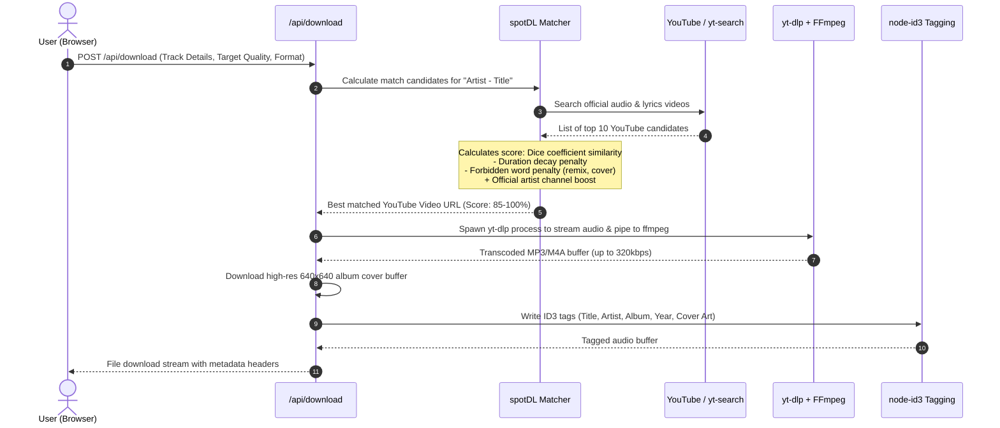
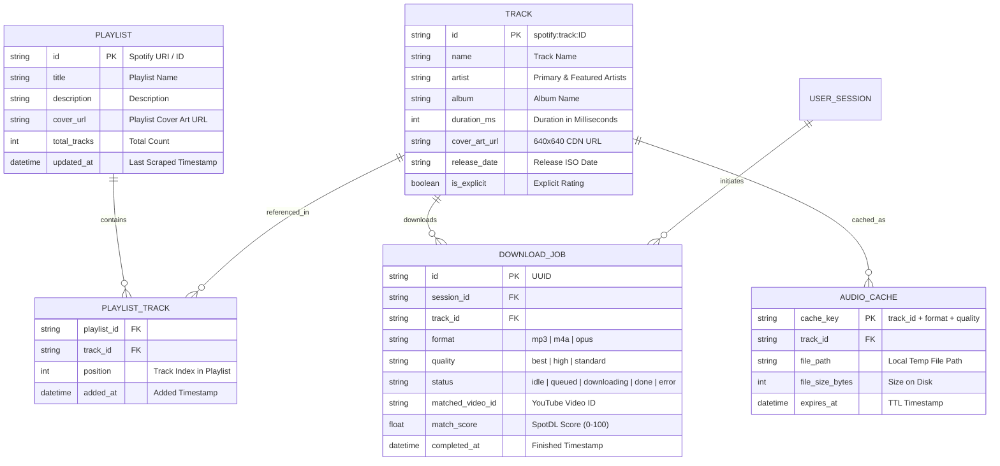

# 🎵 Spotify Importer & Studio Audio Downloader

<div align="center">


**A high-performance, keyless Spotify importer that fetches complete playlists (600+ songs with zero caps), downloads genuine studio audio, and embeds 640×640 album artwork and synced lyrics — with zero Spotify Premium or API credentials required.**

[Features](#-key-features) • [How It Works (No API Key)](#-how-it-works-without-any-api-key) • [System Architecture](#-system-design--architecture) • [Database & Data Model](#-database--data-model-design) • [Quick Start](#-quick-start)

---

### 🖥️ Application Preview
<p align="center">
  
</p>

</div>

---

## ✨ Key Features

- **🚀 100% Keyless & Free:** No Spotify Developer account, no Client ID, no Client Secret, and **zero Spotify Premium** required.
- **📈 Unlimited Playlist Imports (600+ Songs):** Bypasses the traditional 100-song embed limit via internal GraphQL pagination to fetch entire libraries in seconds.
- **🎨 Real Song-Level Artwork (640×640):** Extracts genuine individual track album covers from Spotify's CDN rather than repeating the playlist banner across all songs.
- **🎯 spotDL Matching Algorithm:** Studio recording matching using Dice's coefficient string similarity, exponential duration decay penalties, forbidden word filtering (remix/live/karaoke), and verified artist channel boosts.
- **🎧 High-Quality Multi-Format Encoding:** Download in **MP3 (up to 320 kbps)**, **M4A / AAC**, or **OPUS** powered by `yt-dlp` and `ffmpeg`.
- **🏷️ Automated ID3v2 Tagging:** Writes Song Title, Artist, Album, Release Year, Track Number, and full-resolution Cover Art directly into the downloaded audio file tags.
- **📜 Synced Lyrics Fetching:** Fetches time-synced `.lrc` and plain-text lyrics from public open lyrics databases.
- **💎 Spotify Neon Glow UI:** Modern, immersive dark interface with interactive neon-green glows, batch selection, search filtering, and download folder picker.

---

## 🔓 How It Works (Without Any API Key)

In 2026, Spotify made their official Web API require paid Spotify Premium accounts even for basic Client Credentials access. **This application uses a multi-tier reverse-engineered architecture to stay 100% free and functional:**

```
┌────────────────────────────────────────────────────────────────────────────────────────┐
│                                KEYLESS METADATA ENGINE                                 │
├────────────────────────────────────────────────────────────────────────────────────────┤
│                                                                                        │
│  1. Anonymous Session Bootstrap                                                       │
│     The engine issues a lightweight handshake to Spotify's public web embed surface    │
│     to generate an ephemeral client token without any login credentials.               │
│                                                                                        │
│  2. Spotify Pathfinder GraphQL Querying                                                │
│     Using Spotify's internal Pathfinder endpoint (api-partner.spotify.com), the engine │
│     calls the `fetchPlaylist` operation with persisted query SHA-256 hashes.           │
│                                                                                        │
│  3. Chunked Offset Pagination (343 Tracks/Page)                                        │
│     Unlike public embeds (capped at 100), the GraphQL partner pipeline paginates in    │
│     large chunks (up to 343 songs/query), fetching a 600+ track playlist in < 10s.     │
│                                                                                        │
│  4. True Song Cover Art Extraction                                                     │
│     For each track, the response includes `albumOfTrack.coverArt.sources`. The engine  │
│     extracts the 640×640 JPEG directly from Spotify's `i.scdn.co` CDN.                 │
│                                                                                        │
│  5. Fallback iTunes Catalog Search                                                     │
│     For general search queries or edge-case missing tracks, the system queries Apple's │
│     public iTunes search endpoint to retrieve 600×600 studio metadata with 0 auth.     │
│                                                                                        │
└────────────────────────────────────────────────────────────────────────────────────────┘
```

---

## 🏗️ System Design & Architecture

### High-Level Architecture Diagram



### Download Execution Flow



---

## 🗄️ Database & Data Model Design

The application is engineered as a stateless, high-throughput microservice architecture that can run purely in-memory or bind to a persistent cache/database (e.g. SQLite / Redis / PostgreSQL) for large-scale multi-user production deployments:

### Entity-Relationship Diagram (ERD)



### TypeScript Data Contracts

```typescript
// Core Track Interface
export interface Track {
  id: string;              // Spotify URI or synthetic ID
  name: string;            // Song title
  artist: string;          // Formatted artist string
  album: string;           // Album name
  duration?: number;       // Duration in milliseconds
  coverArt?: string;       // 640x640 album artwork URL
  isPlaylistCover?: boolean; // True if artwork is still fallback
  spotifyUri?: string;     // spotify:track:xxx
  status: 'idle' | 'queued' | 'downloading' | 'done' | 'error';
  error?: string;
}

// Full Playlist Result Interface
export interface ScrapedPlaylistResult {
  type: 'playlist';
  title: string;
  coverArt: string | null;
  total: number;
  tracks: Track[];
}
```

---

## 🛠️ Tech Stack & Dependencies

| Layer | Technologies Used |
| :--- | :--- |
| **Frontend** | [Next.js 15](https://nextjs.org/) (App Router), React 19, [TailwindCSS](https://tailwindcss.com/), [Lucide React](https://lucide.dev/) |
| **Backend** | Next.js API Routes (Node.js Edge & Server Runtime) |
| **Scraping Engine** | Python 3 + `spotapi` (Spotify Pathfinder GraphQL persisted query scraper) |
| **Matching Engine** | Custom spotDL port with Dice Coefficient string similarity (`string-similarity`) |
| **Audio Pipeline** | `yt-dlp` binary, `ffmpeg` transcoder, `yt-search` |
| **Tagging Engine** | `node-id3` (ID3v2 metadata & APIC picture embedding) |
| **Lyrics Engine** | LRCLIB public API (synced & plain text) |

---

## 🚀 Quick Start

### 1. Prerequisites
- **Node.js**: v18.18+ or v20+
- **Python**: 3.10+ (installed and available on your `PATH`)
- **FFmpeg**: installed and added to system `PATH` (used by `yt-dlp` for audio conversion)

### 2. Install Dependencies
```bash
# Clone the repository
git clone https://github.com/Gemy21/Spotify_Importer.git
cd Spotify_Importer

# Install Node.js dependencies
npm install

# Install Python scraping requirements
python -m pip install spotapi spotipyFree
```

### 3. Run Development Server
```bash
npm run dev
```

Open [http://localhost:3000](http://localhost:3000) in your browser.

---

## 📖 Usage Guide

### 1. General URLs & Search
- **Playlists:** Paste any public Spotify playlist URL (e.g. `https://open.spotify.com/playlist/...`).
- **Albums & Tracks:** Paste single track or complete album links.
- **Search:** Simply type artist or track names directly to search with high-resolution results.

---

### 💚 How to Download Your Spotify "Liked Songs" (Step-by-Step)

Spotify treats your **"Liked Songs"** library as a private personal collection without a standard public share link. Follow these **3 simple steps** to download your entire Liked Songs collection (even with 600+, 1,000+ songs!):

#### Method 1: Using the Spotify Desktop App (Recommended - Takes 10 Seconds)
1. **Open Spotify** on your computer (Windows or Mac desktop app).
2. Go to your **"Liked Songs"** tab on the left sidebar.
3. Click on any song in the list, then press:
   - **Windows:** `Ctrl + A` (selects all songs in your library)
   - **Mac:** `Cmd + A`
4. **Right-click** on any highlighted song → select **"Add to playlist"** → **"Create playlist"** *(or drag and drop into a new playlist)*.
5. In your left sidebar, right-click your newly created playlist → select **"Share"** → **"Copy link to playlist"**.
6. Paste that link into **Spotify Importer** and click **Fetch** — all your liked songs will load with their real album covers ready for download!

> 💡 **Tip:** If your new playlist doesn't load publicly, right-click the playlist in Spotify and ensure **"Make Public"** is selected.

#### Method 2: On Mobile (iOS / Android)
1. Open the Spotify mobile app and tap **Your Library** → **Liked Songs**.
2. Tap the **three dots (`...`)** at the top right of the Liked Songs screen.
3. Tap **"Add to other playlist"** → **"New playlist"**.
4. Give it a name (e.g. *My Liked Songs*) and tap **Create**.
5. Open your new playlist, tap the **Share** button (`...` or Share icon), and tap **"Copy Link"**.
6. Paste the link into the app!

---

### 2. Batch Downloading to a Local Folder
1. Once your playlist loads, click **Select All** (or check specific tracks).
2. Click the glowing **Download Selected** button at the bottom.
3. Your browser will prompt you to select a download destination folder on your computer (powered by the modern File System Access API).
4. The engine downloads, converts, tags, and saves every file into that folder automatically!

---

## 📄 License
MIT License. Built for educational and personal use. All music rights belong to their respective copyright holders.
